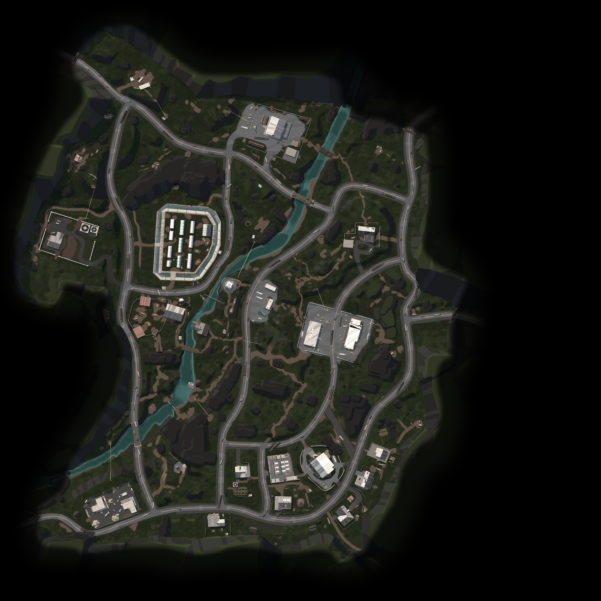

# LILA BLACK — Player Journey Visualization

A high-performance, web-based analytics dashboard for visualizing battle-royale gameplay data. Built with **Next.js 16**, **HTML5 Canvas**, and **Tailwind CSS**.



## Features

- **Interactive Map Canvas** — Player trails rendered on real minimap images (AmbroseValley, GrandRift, Lockdown)
-  **Animated Playback** — Scrub through matches at 0.5×–20× speed with a smooth 60fps canvas loop
- **Density Heatmaps** — Kill, death, loot, and traffic hotspots across all 797 matches
- **Player Legend** — Filter by human/bot, highlight individual players
- ⚡ **Virtualised Sidebar** — 797 matches rendered instantly via virtual scroll (only ~15 DOM nodes at a time)
- **Match Filtering** — Filter by map, date, and "has kills" toggle

## Tech Stack

| Layer | Choice |
|---|---|
| Framework | Next.js 16 (App Router, static export) |
| Rendering | HTML5 Canvas 2D (no WebGL) |
| Styling | Tailwind CSS v3 |
| Language | TypeScript |
| Data Pipeline | Python 3 + PyArrow + Pandas |

## Project Structure

```
lila-black-viz/
├── scripts/
│   └── preprocess.py       # Converts .nakama-0 Parquet files → JSON
├── public/
│   ├── minimaps/           # Map background images (committed)
│   └── data/               # Generated JSON — NOT committed (see below)
│       ├── match_index.json
│       ├── matches/        # One JSON per match
│       └── heatmaps/       # One JSON per map
└── src/
    ├── app/page.tsx         # Main page + animation loop
    ├── components/
    │   ├── MapCanvas.tsx    # Canvas renderer (journey + heatmap)
    │   ├── MatchSidebar.tsx # Virtualised match list
    │   ├── EventTimeline.tsx# Playback scrubber
    │   └── PlayerLegend.tsx # Player colour legend
    ├── hooks/useMatchData.ts# Data fetching hooks
    └── lib/
        ├── types.ts         # TypeScript interfaces
        └── colorHash.ts     # Deterministic HSL colours per player
```

## Getting Started

### 1. Prerequisites

- Node.js 22+
- Python 3.10+ with `pyarrow` and `pandas`

```bash
pip install pyarrow pandas
```

### 2. Generate the data

Point the preprocessor at your raw Parquet data folder:

```bash
python3 scripts/preprocess.py --data /path/to/player_data --out public/data
```

This reads all `.nakama-0` Parquet files and outputs:
- `public/data/match_index.json` — index of all matches
- `public/data/matches/{id}.json` — per-match player events
- `public/data/heatmaps/{MapId}.json` — aggregated heatmap points

### 3. Run the dev server

```bash
npm install
npm run dev
# → http://localhost:3000
```

### 4. Build for production

```bash
npm run build   # outputs to /out (static export)
```

## Data Format

The preprocessor expects a folder structured as:

```
player_data/
├── February_10/
│   ├── {user_id}_{match_id}.nakama-0   # human players
│   └── {bot_id}_{match_id}.nakama-0    # bots
├── February_11/
...
```

Each Parquet file has columns: `ts` (unix timestamp in seconds), `x`, `z` (world coordinates), `event` (string), `user_id`, `match_id`, `map_id`.

### Supported Maps

| Map ID | Scale | Origin (x, z) |
|---|---|---|
| AmbroseValley | 900 | −370, −473 |
| GrandRift | 581 | −290, −290 |
| Lockdown | 1000 | −500, −500 |

## Performance Notes

The animation system is designed to never trigger React re-renders during playback:

- **Canvas drives itself** — `requestAnimationFrame` loop updates a `ref`, canvas redraws directly
- **React state** updates at ~15fps (for the timeline UI only), not 60fps
- **Virtualised sidebar** — renders only the ~15 visible match cards regardless of total count
- **Binary search** — O(log n) event lookup per player per frame instead of O(n) filter
- **Batched trail strokes** — 4 opacity buckets per player instead of 40 individual `ctx.stroke()` calls
- **Canvas event marks** — timeline ticks drawn on an offscreen canvas once per match

